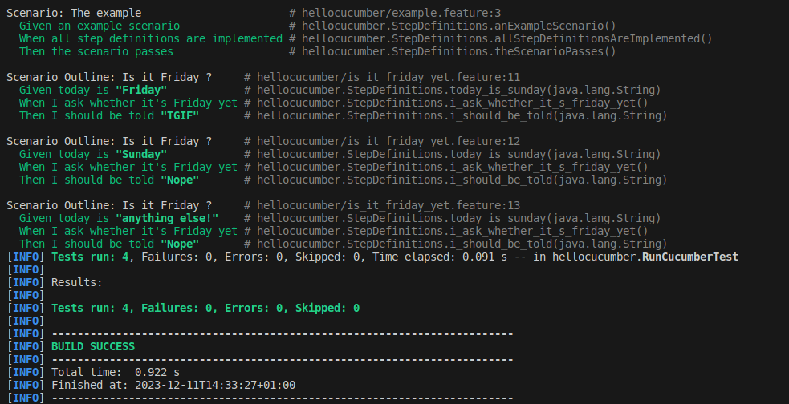
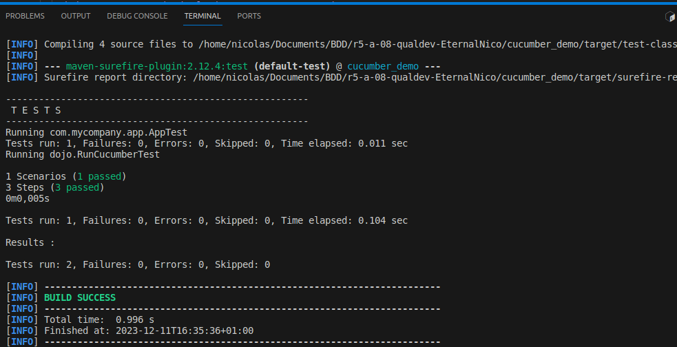
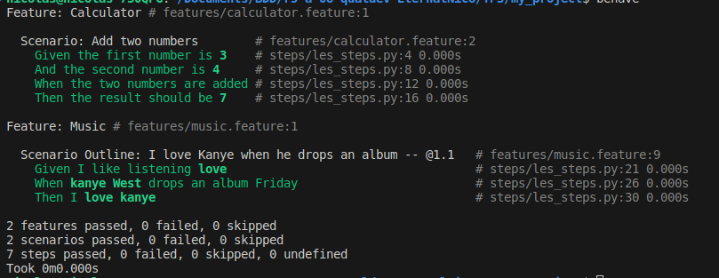
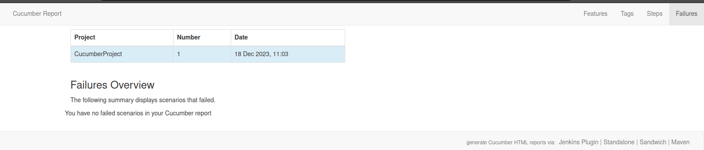
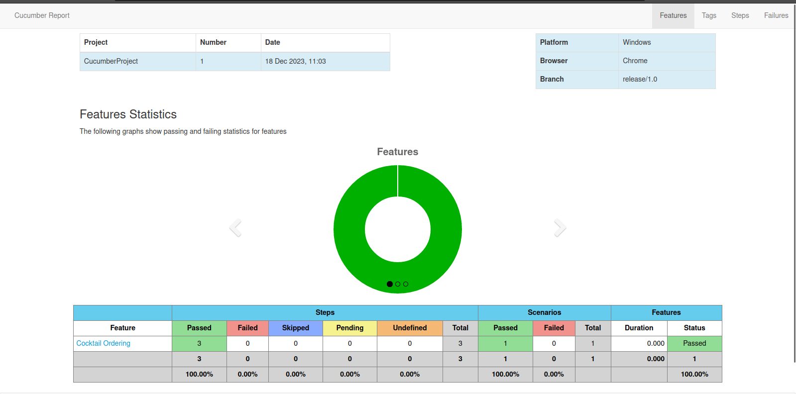
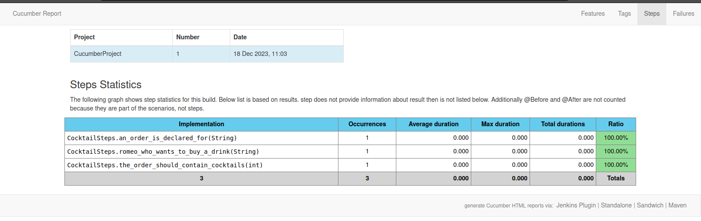
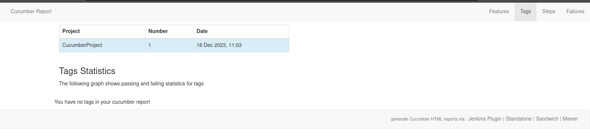
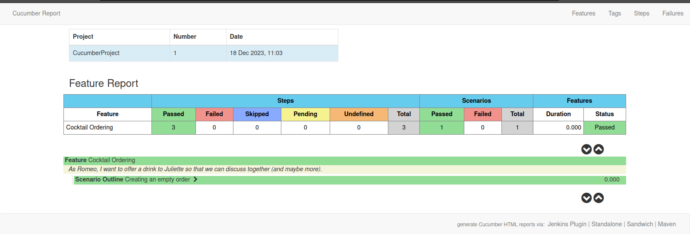

= R5.A.08 -- Dépôt pour les TPs
:icons: font
:MoSCoW: https://fr.wikipedia.org/wiki/M%C3%A9thode_MoSCoW[MoSCoW]

Ce dépôt concerne les rendus de mailto:A_changer@etu.univ-tlse2.fr[Sacilotto Nicolas].

== TP1

.Exemple de code
[source,ruby]

----
Feature: Is it Friday yet?
  Everybody wants to know when it's Friday

  Scenario Outline: Is it Friday ?
    Given today is "<day>"
    When I ask whether it's Friday yet
    Then I should be told "<answer>"

Examples:
    | day            | answer |
    | Friday         | TGIF   |
    | Sunday         | Nope   |
    | anything else! | Nope   |
----

.Tests réussis  TP1

== TP2...

La classe Order.java

.Exemple de code
[source,java]

----
package dojo;
import java.util.ArrayList;
import java.util.List;
public class Order {
private String owner;
private String target;
private List<String> cocktails;
public Order() {
this.cocktails = new ArrayList<>();
}
public void declareOwner(String owner) {
this.owner = owner;
}
public void declareTarget(String target) {
this.target = target;
}
public void addCocktail(String cocktail) {
this.cocktails.add(cocktail);
}
public List<String> getCocktails() {
return new ArrayList<>(cocktails);
}
public String getOwner() {
return owner;
}
public String getTarget() {
return target;
}
}
----

.Tests réussis TP2

== TP3

J'ai utilisé le langage python pour réalisé ce tp.

La classe musique.py

.La classe musique.py
[source,python]

----
class Musique:
    def __init__(self, like_listening_music=False):
        self.like_listening_music = like_listening_music
        self.album_dropped = False
        self.love_kanye = False

    def listen_music(self):
        self.like_listening_music = True

    def drop_album(self):
        if self.like_listening_music:
            self.album_dropped = True

    def love_kanye_now(self):
        if self.album_dropped:
            self.love_kanye = True

----

Les features ajoutés : 

.Le premier feature calculator
[source,python]

----
Feature: Calculator
    Scenario: Add two numbers
        Given the first number is 3
        And the second number is 4
        When the two numbers are added
        Then the result should be 7

----

.Le deuxième feature la musique
[source,python]

----
Feature: Music
    Scenario Outline: I love Kanye when he drops an album
        Given <love> like listening <music>
        When <artist> West drops an album Friday
        Then <love> love <artist>

Examples:
    | love     | music    | artist   |
    | I        | love     | kanye    |

----

.Tests réussis TP3

== TP4

Le but de ce tp était de créer une documentation en lien avec les tests réalisés lors des anciens tp, j'ai utilisé la méthode avec cukedoctor.

la classe RunCucumberTest.java

.La classe musique.py
[source,java]

----
package dojo;

import cucumber.api.junit.Cucumber;
import org.junit.runner.RunWith;
import cucumber.api.CucumberOptions;
import net.masterthought.cucumber.Configuration;
import net.masterthought.cucumber.ReportBuilder;
import org.junit.AfterClass;

import java.io.File;
import java.util.ArrayList;
import java.util.List;

@RunWith(Cucumber.class)
@CucumberOptions(plugin = {"json:target/cucumber.json"} )
public class RunCucumberTest { 
    @AfterClass
    public static void generateReport() {
        File reportOutputDirectory = new File("doc");
        List<String> jsonFiles = new ArrayList<>();
        jsonFiles.add("target/cucumber.json");

        String buildNumber = "1";
        String projectName = "CucumberProject";
        Configuration configuration = new Configuration(reportOutputDirectory, projectName);
        configuration.setBuildNumber(buildNumber);
        configuration.addClassifications("Platform", "Windows");
        configuration.addClassifications("Browser", "Chrome");
        configuration.addClassifications("Branch", "release/1.0");

        ReportBuilder reportBuilder = new ReportBuilder(jsonFiles, configuration);
        reportBuilder.generateReports();
    }
}

----

Le changement dans le pom.xml

.L'ajout des dépendances dans pom.xml
[source,java]

----
<dependency>
    <groupId>com.github.cukedoctor</groupId>
    <artifactId>cukedoctor-converter</artifactId>
    <version>3.7.0</version>
</dependency>
<dependency>
    <groupId>net.masterthought</groupId>
    <artifactId>cucumber-reporting</artifactId>
    <version>5.5.3</version> 
</dependency>

----

Voici les screens des pages html générées par la commande `mvn clean test`

.Screen des fichiers html présents sous /doc

